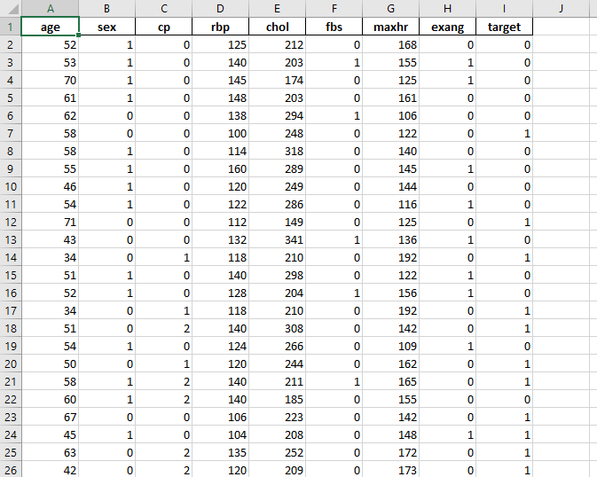
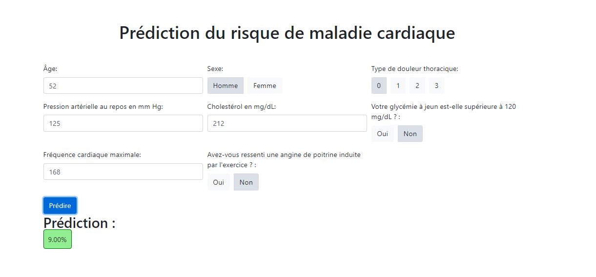

# Cardiovascular Disease Diagnosis Tool

This application leverages machine learning models and web technologies to provide a smart and fast tool for diagnosing cardiovascular diseases. By utilizing medical data and risk factors, the tool aims to assist healthcare professionals in making accurate and timely diagnoses.

## Technologies Used

The application is built using the following technologies:

- **Programming Language:** Python
- **Framework:** Flask
- **Python Libraries:**
  - `scikit-learn`: For machine learning model development.
  - `pandas`: For data manipulation and analysis.
  - `pickle`: For serializing and de-serializing Python objects (such as trained models).
  - `SQLAlchemy`: For database interaction and ORM (Object-Relational Mapping).
- **Data Sources:**
  - **Microsoft Excel:** For handling data in spreadsheet format.
  - **Google Colab:** For collaborative coding and model training.
  - **Kaggle:** For accessing cardiovascular disease datasets.
- **Database:** SQLAlchemy for relational database management.

## Features

- **Predictive Modeling:** Utilizes machine learning models trained on medical data to predict cardiovascular disease risk.
- **Web Interface:** User-friendly web interface built with Flask, enabling easy interaction with the prediction model.
- **Data Handling:** Supports data input through Microsoft Excel files and integrates with Google Colab for model training and experimentation.
- **Database Management:** Uses SQLAlchemy for efficient data storage and retrieval.

## Screenshots

### Excel Data Input

### Prediction Results

